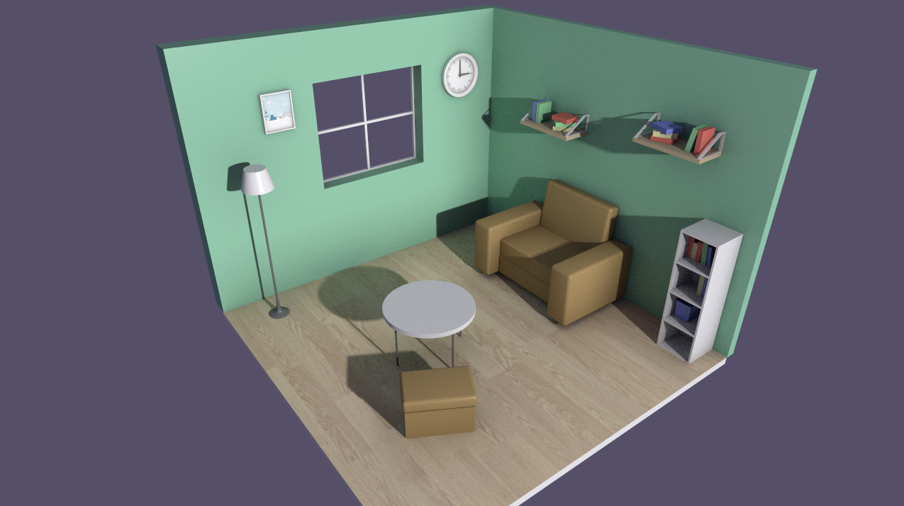

# Path Tracer Demo using Evergine
---
This is a toy path tracer demo used to show the Evergine raytracing common low-level API capabilities. In this demo, you can see how to implement a little room path tracer with _Soft Shadow_, _Ambient Occlusion_, _Global Ilumination_, and _Antialiasing_.

For more details about this demo read this [article]().

_Note. The room model cortesy of Hedgehog https://sketchfab.com/3d-models/room-b3880b99c5214c9f8fd3f7d1473df661_

## Build and Run

- Required Visual Studio 2022 with.NET6 support
- Required Graphics card with Raytracing technology _(Ej. NVidia Geforce 2060 or higher)_
- DirectX12 and Vulkan support. (Change in the program.cs or pass as arguments)

## Parameters

The parameters available for manage the path tracer render are:
- Camera Pos X: Move the camera position in X-axis.
- Camera Pos Y: Move the camera position in Y-axis.
- Camera Pos Z: Move the camera position in Z-axis.
- Light Radius: Light radius affect the shadows.
- AO Num. Rays: Number of Ambient occlusion rays.
- AO Radius: Lenght of the ambient occlusion rays.
- GI Num Bounces: Number of bounces of Global illumination rays.
- Num Samples: Number of samples used to the path tracer render.

## Compile Shader HLSL to SpirV
To compile HLSL _(DX12)_ shader to SpirV _(Vulkan)_ you can use the **shaderTranslator.ps1** script in _Content/Shaders folder_.

---
Powered by Evergine

